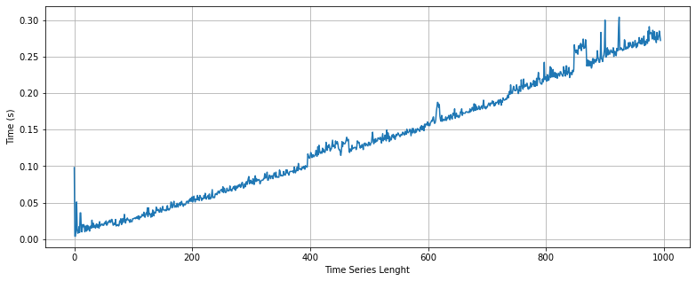
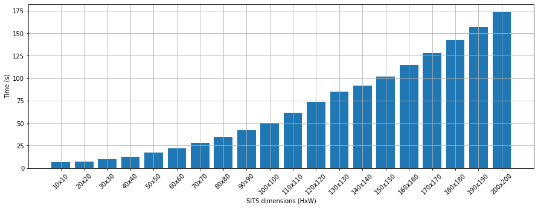

Benchmark
----------

We assessed the performance of two main functions of stmetrics: `get_metrics` and `sits2metrics`. For that, we used a core i7-8700 CPU @ 3.2 GHz and 16GB of RAM memory. With this test we wanted to assess the performance of the package to compute the metrics available under different scenarios.

We compared the performance of those functions regarding execution time. For `get_metrics` function, we assessed the performance using randomn time series, created with numpy, with different leghts. For the `sits2metrics` function we used images with different dimensions in columns and rows, maitaining the same length. 

`get-metrics` analysis
======================

To evaluate the performance of `get_metrics` function, we implemented a simple test using radomn time series built with `numpy` package that can be acessed at: .

	
	Fig 1. Execution time of get_metrics functions with different time series lenghts.

As shown above, the `get_metrics` function presents a quadratic response regarding the length of the time series. It is able to compute the metrics for a time series with 1,000 data points in less than **two second**. This beahaviour is explained by some polar metrics that requires more computational time, for example the `symmetry_ts` function. For the following versions, we will try to improve the performance of the package.

`sits2metrics` analysis
=======================

To evaluate the `sits2metrics` function we used a sample image with the following dimensions: 249x394 and 12 dates. With this test, we aim to assess how the size of the image impacts the total time to compute the metrics. 

This function uses the multiprocessing library to speed up the process. According to the previous test, a time series with 12 dates as our sample requires 0.015s to compute the metrics for one pixel, therefore using a single core this should require 1,318s or approximately 21minutes. With the parallel implementation, according to our tests, the package perform the same task in 6 minutes.

	
	Fig 2. Execution time of sits2metrics with different sizes images.